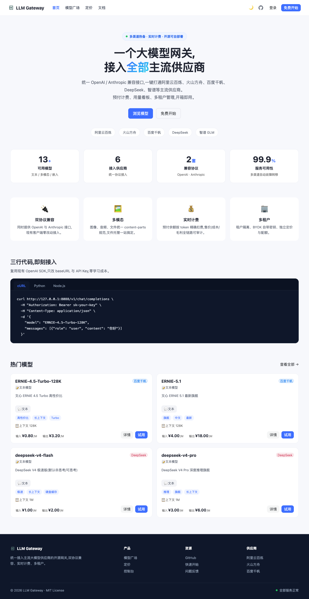
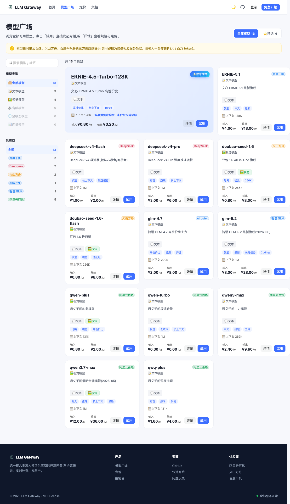
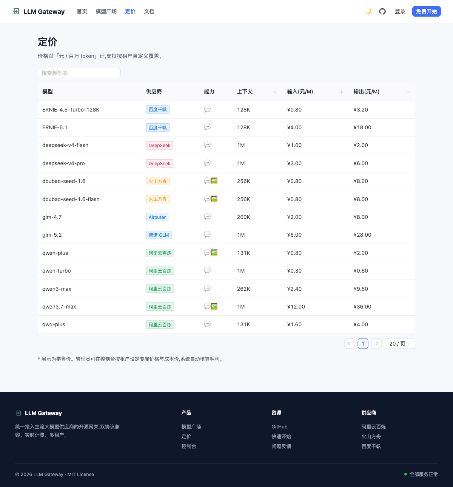

# LLM Gateway

[](https://github.com/aitoys/llm-gateway/actions/workflows/ci.yml)
[](https://goreportcard.com/report/github.com/aitoys/llm-gateway)
[](https://codecov.io/gh/aitoys/llm-gateway)
[](https://go.dev)
[](https://github.com/aitoys/llm-gateway/releases)
[](LICENSE)

**English** | [简体中文](README.md)

> An open-source multi-tenant LLM gateway: unify access to major LLM providers and expose both **OpenAI**- and **Anthropic**-compatible APIs. Built-in multimodal, prepaid metering, API key management, usage dashboards and a multi-turn chat console.

Built on a "ports & adapters (hexagonal)" architecture: the dual-protocol ingress is normalized to an OpenAI-format internal canonical representation, and provider adapters translate it to each upstream's native protocol. All bundled providers offer OpenAI-compatible endpoints, so they share one adapter implementation.

## ✨ Highlights

- **Dual-protocol ingress** — `/v1/chat/completions` (OpenAI) and `/v1/messages` (Anthropic) are semantically interchangeable.
- **Multiple providers** — Alibaba Bailian (Qwen), Volcano Ark (Doubao), Baidu Qianfan (ERNIE), DeepSeek, Zhipu GLM, plus a Mock provider for development. Adding a provider takes one OpenAI-compatible adapter.
- **Multimodal** — OpenAI content-parts as the internal canonical format, with `/v1/files` file hosting (image / audio / file).
- **Prepaid metering** — per-token real-time billing (streaming accumulates per chunk); price / cost / margin recorded end-to-end. **Single-transaction deduction (`FOR UPDATE`) + non-negative balance CHECK + input-cost precheck** prevent concurrent overdraft and ledger drift.
- **Billing closure** — idempotent retry on billing failure (inline exponential backoff + background worker + partial unique index), no double-charge / missed charge; the ledger is the single source of truth for money.
- **Payment & recharge** — WeChat Native + Alipay PC + Mock (dev); order state machine (pending → paid / closed) + idempotent callback crediting.
- **Hybrid keys** — platform default channel pool + tenant BYOK override.
- **Multi-tenant** — self-service registration, chat console, API keys, usage, recharge; **platform / tenant admin split** (platform super-admin spans tenants; tenant admin is scoped; data/control plane isolated per tenant).
- **Team collaboration** — tenant admins invite members via **signed links** and can **distribute balance** to members (atomic single-transaction transfer, paired ledger entries).
- **Channel scheduling** — multi-channel by priority / weight, tenant channels override platform defaults; per-channel backoff on transient errors + cross-channel failover.
- **Request / response logging** — optional full payload logging (sampling / truncation / retention configurable), `X-Request-Id` correlates request logs / usage / ledger / structured logs end-to-end.
- **Usage quotas** — per-key RPM / TPM (minute) + daily / monthly request and token limits, progressive 429 on overflow.
- **Tool-call normalization** — OpenAI tools ↔ Anthropic `tools` / `tool_use` / `tool_result` bidirectional (incl. streaming `input_json_delta`).
- **Observability** — Prometheus `/metrics` (RPM / TPM / latency / billing / circuit-breaker / in-flight), `/healthz` + `/readyz` probes, structured logs with `request_id`.
- **Single-binary deployment** — frontend SPA build embedded; one port serves everything.

## 🖼 Screenshots

<table>
  <tr>
    <td align="center">Home</td>
    <td align="center">Marketplace</td>
    <td align="center">Pricing</td>
  </tr>
  <tr>
    <td></td>
    <td></td>
    <td></td>
  </tr>
</table>

## 🏗 Architecture

```
OpenAI client ──►  OpenAI ingress  ─┐
Anthropic client►  Anthropic ingress┘┘──► canonical (OpenAI format)
                                                 │
                                   ┌─────────────┴─────────────┐
                                   │  Core: auth/route/limit/bill │
                                   └─────────────┬─────────────┘
                          Provider Port (Chat/Stream/Embed)
                 ┌────────┬────────┬────────┬──────────┬────────┐
              bailian  volcark  qianfan  deepseek/zhipuai  mock
```

## 🚀 Quick start

Requirements: Go 1.26+, Node 20+, PostgreSQL 16+, Redis 7+.

```bash
git clone https://github.com/aitoys/llm-gateway && cd llm-gateway
cp config.example.yaml config.local.yaml   # edit DB / Redis / JWT secret / channel key
make run                                    # build frontend + run gateway
```

Then open http://localhost:8088.

## 📚 Documentation

Full docs site at [`docs-site/`](./docs-site) (VitePress): quick start, concepts, models & pricing, multi-provider load balancing, billing, deployment, config reference, architecture & data model.

## 🔐 Security

See [SECURITY.md](SECURITY.md). **Never run with `dev: true` in production** — it relaxes key validation and opens self-service recharge/registration.

## License

[MIT](LICENSE) © aitoys / llm-gateway contributors
